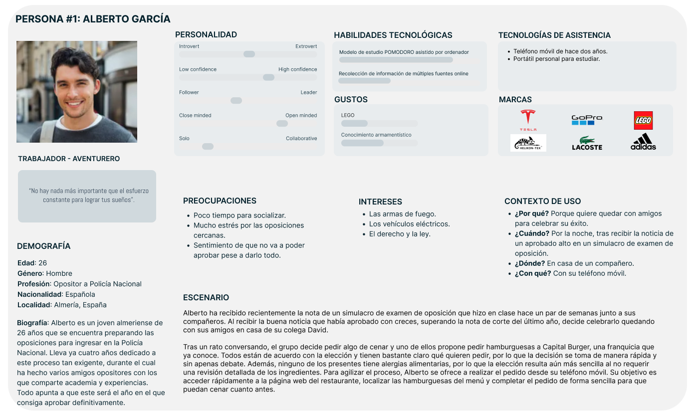
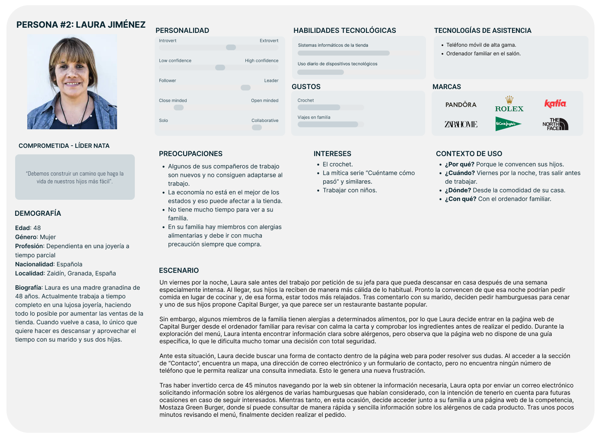

# DIU26
Prácticas Diseño Interfaces de Usuario [Tema: Sabores con encanto (Fast Food experience)]

* [Guiones de prácticas](GuionesPracticas/)
* [Guía para crea tu Case Study](Guia_CaseStudy.md)
* Sala de la Fama [DIU Hall of fame](https://github.com/mgea/DIU/tree/master/hall_of_fame) donde se pueden encontrar Case Study destacados de otros años.

Actualizado: 19/03/2026

## Paso 0 My UX-Case Study
 
-----

Grupo: DIU3_MASE.  Curso: 2025/26 

Nombre del Proyecto: 

>>> Decida el nombre corto de su propuesta en la práctica 2 

Descripción: 

>>> Describa la idea de su producto en la práctica 2 

Logotipo: 

>>> Si diseña un logotipo para su producto en la práctica 3 pongalo aqui, a un tamaño adecuado. Si diseña un slogan añadalo aquí

Miembros y nombre del equipo: MASE
 * :bust_in_silhouette:  Manuel Enríquez Ledesma     :octocat:  [manuenrle](https://github.com/manuenrle)     
 * :bust_in_silhouette:  Sergio González Rodríguez     :octocat:  [ZyrearUni](https://github.com/ZyrearUni)

----- 

 

# Proceso de Diseño 

 

## Paso 1. UX User & Desk Research & Analisis 

### 1.a User Reseach Plan
 
-----

**1. Antecedentes y Objetivos (The "Why").**

- **Contexto:** Este proyecto busca mejorar la interfaz de la página web de la hamburguesería **Capital Burger**, para hacerla más comprensible, accesible y atractiva al usuario que la visite.

- **Objetivos de investigación:** Además de mejorar la experiencia del usuario al usar la plataforma, se busca determinar cómo atraer a más clientes e incrementar las ventas, tanto en el local como en la tienda online. En concreto, se evaluarán aspectos como, por ejemplo, los siguientes:

    - Si la disposición y organización de la carta de la página web permite al cliente navegar con facilidad y encontrar un producto específico en un tiempo inferior a 30 segundos.
   
    - Si el cliente puede realizar un pedido a su gusto con facilidad empleando el sistema de pedidos de la página web y si puede completarlo en un tiempo inferior a 4 minutos desde que inicia la selección hasta que hace clic en “Confirmar pedido”, pudiendo añadir, eliminar o modificar productos según sus preferencias de manera intuitiva y sin obstáculos.
   
    - Se estudiará si las imágenes de los productos e ingredientes son lo suficientemente representativas para que los usuarios puedan identificar cada opción sin necesidad de leer el texto, y, de manera inversa, si la información textual es clara y suficiente para comprender los productos en caso de que las imágenes no estuvieran disponibles.
   
    - Si el cliente puede encontrar en menos de 20 segundos la dirección del local de Capital Burger que le interese en el momento actual, así como el horario de apertura y un medio de contacto.

- **Experiencia del equipo / justificación:**
  
    - **Como clientes y entusiastas del mundo de la gastronomía**, y más concretamente del mundo de las hamburguesas, creemos que con nuestros conocimientos y experiencias en distintos locales de hamburguesas (rápidas o gourmet) podemos llegar a cumplir los objetivos de esta investigación.
   
    - **Como diseñadores**, tenemos una base de conocimientos adquiridos en usabilidad, accesibilidad y experiencia de usuario que pueden ser aplicables a este proyecto, desarrollados en otras asignaturas del Grado como Sistemas de Información Basados en Web (SIBW), Dirección y Gestión de Proyectos (DGP) y Metodologías de Desarrollo Ágil (MDA).

**2. Metodología (The "How").**

La estrategia o metodología que seguiremos para llevar a cabo nuestra investigación será la siguiente: Comenzaremos empleando una herramienta de tipo **comparativa**, que se basará en la realización de un análisis de la competencia (*Competitor Analysis*) con plataformas similares (en nuestro caso, escogeremos Mostaza Green Burger y Burger King). A continuación, crearemos personas ficticias que nos ayuden a entender mejor al público objetivo, así como mapas de experiencia del usuario (*User Journey Experience Maps*) para cada una de esas personas que nos ayudarán a describir la interacción del usuario realizando las diferentes tareas. Por último, finalizaremos con una revisión de usabilidad (*Usability Review*), donde actuaremos como expertos en usabilidad.

**3. Perfil de los Participantes (The "Who").**

A continuación, se presenta el perfil de los participantes, incluyendo criterios de inclusión y segmentación para garantizar que la investigación refleje de forma adecuada al público objetivo:

- **Criterios de inclusión:**
  
    - **Edad:** Principalmente, personas mayores de edad.

    - **Frecuencia de uso:** personas que consultan páginas web de comida rápida con regularidad.

    - **Hábitos de uso:** personas que suelen visitar la página web durante los periodos de alta demanda (la hora de comer y/o la de cenar).

    - **Nivel de competencia digital:** básica, es decir, suficiente para navegar y utilizar de manera autónoma una página web sencilla.
  
- **Segmentación:**
  
    - **Usuarios de clase (co-evaluación):** principalmente nuestro profesor y nuestros compañeros y compañeras del subgrupo 3 de prácticas de la asignatura de Diseño de Interfaces de Usuario (DIU). Se utilizarán principalmente para validar la metodología y detectar problemas importantes de usabilidad antes de probar con usuarios externos.

    - **Usuarios externos:** participantes representativos del público objetivo de la página web de Capital Burger, seleccionados de acuerdo a los criterios de inclusión definidos. Se utilizarán para comprender y evaluar mejor al público objetivo y para identificar posibles problemas que hayan podido pasar desapercibidos con los usuarios de clase.

**4. Guión y Tareas (The "What").**

Para lograr evaluar los diferentes aspectos que hemos propuesto en el objetivo de la investigación, le vamos a pedir que el usuario haga exactamente las siguientes tareas:

- **“Busca en la carta la hamburguesa específica llamada *Metro*”.**   Para comprobar que el usuario puede encontrarla con facilidad y en un tiempo inferior a 30 segundos.

- **“Completa la siguiente simulación de pedido en la web: como entrante, escoge unos *Cheese Rings*; como hamburguesa, quédate con la *Capital Classic*; y, como bebida, pide el botellín de 500 ml de agua. Por último, elimina como entrante los *Cheese Rings* y sustitúyelos por los *Bites de Queso*, al ser un poco más baratos, y añade otro botellín de 500 ml de agua. Para finalizar tu pedido, haz clic en el botón de ‘*Confirmar pedido*’”.**   Para comprobar que el usuario puede realizar un pedido a su gusto con facilidad empleando el sistema de pedidos de la página web y completarlo en un tiempo inferior a 4 minutos, pudiendo además ajustarlo de forma sencilla según sus preferencias.

- **“Observa la hamburguesa *The Royal Burger* de la carta e identifica sus ingredientes únicamente a partir de la imagen, sin leer la descripción. Después, lee la descripción y verifica si coincide con los ingredientes que habías identificado”.**   **“Lee la descripción de la hamburguesa *La Triunfada* de la carta sin mirar la imagen. Imagina cómo sería el producto en tu mente y, luego, compara tu idea con la imagen real para ver si se asemeja a lo que habías imaginado”.**   Para evaluar si las imágenes son representativas y si la información textual es clara y suficiente para el usuario.

- **“Encuentra la dirección del local de Capital Burger que te interese, así como su horario de apertura y un medio de contacto”.**   Para comprobar que el usuario puede encontrar en menos de 20 segundos la dirección del local de Capital Burger que le interese en el momento actual, así como el horario de apertura y un medio de contacto.

**5. Cronograma y Entregables.**

A lo largo del estudio, se van a desarrollar los siguientes entregables y en el siguiente orden:

- El presente documento, **Plan de Investigación de Usuario (*User Research Plan*)**, que es el documento estratégico que define los cimientos del estudio de usabilidad. Funciona como una “hoja de ruta” que explica qué queremos aprender, a quién se los vamos a preguntar, cómo vamos a obtener los datos y cuándo estarán listos los resultados.

- Comenzaremos el estudio con la realización de un **análisis de la competencia (*Competitor Analysis*)** con plataformas similares (en nuestro caso, escogeremos Mostaza Green Burger y Burger King).

- A continuación, crearemos **personas ficticias** que nos ayuden a entender mejor al público objetivo.

- Después, elaboraremos **mapas de experiencia del usuario (*User Journey Experience Maps*)** para cada una de esas personas que nos ayudarán a describir la interacción del usuario realizando las diferentes tareas.

- Finalizaremos con una **revisión de usabilidad (*Usability Review*)**, donde actuaremos como expertos en usabilidad, recogiendo las mejoras que realizaríamos en la página web.

- Por último, también realizaremos un **Briefing**, que actuará como un resumen ejecutivo de la práctica, redactado como si quisiéramos aportar la revisión de un experto en UX/Usabilidad sobre el sitio web Capital Burger.

:link: **Enlace al archivo PDF: [User Resarch Plan](P1/1.User_Research_Plan/User_Research_Plan.pdf)**

### 1.b Competitive Analysis
 
-----

Para el análisis competitivo, hemos optado por utilizar dos páginas que se centran en dos nichos distintos del mercado:

- **Burger King:** Cadena internacional de comida rápida por excelencia, con un estilo más clásico y accesible que las propuestas gourmet.

  Motivo de la elección: Se ha seleccionado Burger King para evaluar el mercado de la comida rápida, ya que es una de las cadenas de hamburguesas más reconocidas y, habitualmente, una de las primeras que vienen a la mente cuando se piensa en este tipo de producto.

- **Mostaza Green:** Restaurante popular con un toque divertido y original para personas interesadas en hamburguesas gourmet.
	
  Motivo de la elección: Se ha seleccionado también Mostaza Green para analizar el segmento de hamburguesas más gourmet. Además, es un local bastante conocido en la zona, lo que lo convierte en un buen referente para este tipo de oferta.

Ambas páginas ofrecen servicios similares a los de **Capital Burger** y son populares en nuestra zona de trabajo (Granada). Además, representan dos enfoques distintos del mercado de las hamburguesas (uno más orientado a la comida rápida y otro más cercano al estilo gourmet), lo que nos permite analizar el sector desde dos perspectivas diferentes. Por tanto, esto nos será de gran ayuda para cumplir con los objetivos de nuestra investigación.

Para poder realizar una comparativa más objetiva, hemos decidido evaluar los siguientes criterios con una puntuación de 0 a 3 estrellas:

- **Modelo de negocio:**
    - **Actualizaciones frecuentes:** la frecuencia en la que el menú ofrecido obtiene novedades.
    - **Métodos de pago:** qué métodos de pago ofrece la página para realizar el pedido (tarjeta, bizum, Google Pay, PayPal…)
    - **Estrategia de marketing:** cómo atrae la página a más clientes.

- **Arquitectura de la información:**
    - **Organización de contenidos:** si la página está bien organizada y se entiende lo que se está viendo.
    - **Menú de navegación:** si el menú de navegación es completo y fácil de comprender.
    - **Accesos rápidos:** si existen los accesos rápidos y son útiles.

- **Diseño, Usabilidad y Accesibilidad:**
    - **Diseño intuitivo:** si la página tiene un diseño sencillo, limpio, coherente y es fácil de usar.
    - **Contraste y legibilidad:** si el contenido de la página se puede entender y la paleta de colores es buena.
    - **Texto alternativo:** si las imágenes poseen un texto alternativo para lectores de pantalla.
    - **Soporte multilingüe:** si la página permite cambiar a otros idiomas.

- **UX y Funcionalidad:**
    - **Opciones de filtrado y búsqueda:** si se pueden filtrar y/o ordenar los productos dependiendo de los ingredientes, las promociones, el precio, etc.
    - **Rendimiento de la página:** que la página cargue y reaccione a los inputs del usuario de manera rápida.
    - **Contacto:** si la página posee información de contacto y esta es fácil de obtener.

- **Cuestiones subjetivas:**
    - **Puntos fuertes:** aspectos de la página que, bajo nuestro punto de vista, destacan y mejoran la experiencia del usuario.
    - **Puntos débiles:** aspectos de la página que, bajo nuestro punto de vista, pueden dificultar la experiencia o resultar menos efectivos.
    - **Conclusiones:** breve resumen de la experiencia general y aprendizajes obtenidos del análisis.

 

**CONCLUSIÓN GENERAL TRAS EL COMPETITOR ANALYSIS:**

En conclusión, el análisis muestra claras diferencias entre las páginas estudiadas.   Burger King destaca por ser la opción más completa y sólida, con un modelo de negocio muy desarrollado, lo que la convierte en una página casi perfecta.  
Mostaza Green Burger presenta una propuesta visual atractiva, con una arquitectura de la información prácticamente excelente, aunque todavía con muchos otros aspectos mejorables.  
Por último, nuestro caso de estudio, Capital Burger, a pesar de su originalidad, presenta más carencias en comparación con las otras páginas de la competencia analizadas, resultando muy mejorable en prácticamente todos los aspectos evaluados.

Por tanto, **según nuestro análisis, el orden de las páginas de mejor a peor sería el siguiente: Burger King, Mostaza Green Burger, Capital Burger**.

:link: **Enlace al archivo PDF: [Competitor Analysis](P1/2.Competitor_Analysis/Competitor_Analysis.pdf)**

### 1.c Personas
 
-----

Para poder realizar un mejor análisis de la página web de Capital Burger en su estado actual, hemos optado por crear dos perfiles relativamente parecidos pero con unas claras diferencias en personalidad, contexto y necesidades.

Por un lado, se tiene a **Alberto García**, un joven almeriense de 26 años y opositor a Policía Nacional, acostumbrado a pasar largas horas estudiando solo, que emplea su propio teléfono móvil para hacer un pedido con sus amigos y así despejarse un poco y celebrar sus éxitos. Representa a un usuario con un objetivo inmediato y sencillo, sin problemas de alergias alimentarias y con una interacción directa y rápida.

Por el otro, se tiene a **Laura Jiménez**, una madre granadina de 48 años y dependienta en una joyería con ganas de pasar más tiempo con su familia, cuyo contexto es más complejo al incluir responsabilidades familiares y la presencia de alergias alimentarias en su entorno. En su caso, utiliza el ordenador familiar para realizar un pedido totalmente ajustado a las necesidades de todos los miembros de su familia, por lo que nos encontramos ante una interacción más reflexiva y orientada a la búsqueda de información, en la que la toma de decisiones requiere mayor atención.

Ambos perfiles comparten un escenario general similar: van a pedir hamburguesas para cenar con un grupo de personas. Sin embargo, el contexto de uso y las necesidades de dichos escenarios es distinto. Esta elección permite analizar cómo un mismo servicio debe adaptarse a distintos tipos de usuario, mostrando la importancia de tener en cuenta tanto personas y escenarios simples como situaciones que requieren mayor nivel de detalle en la información ofrecida y una toma de decisiones más delicada y elaborada.

:link: **Enlaces a los archivos PDF: [Persona 1: ALberto García](P1/3.Personas/Persona_1.pdf), [Persona 2: Laura Jiménez](P1/3.Personas/Persona_2.pdf)**

### 1.d User Journey Map
 
----

>>> Describe el porqué de las dos experiencias de usuario contadas en el journey map. Por ejemplo, reflexiona si te parece que son habituales. Enlaza con los recursos journey que están en la carpeta P1/. Borra esta linea del template cuando termines.  

### 1.e Usability Review
 
----

>>>  El objetivo es revisar la usabilidad del competidor seleccionado. Usamos un checklist de verificación. Tras usarlo, subelo a la carpeta P1/ Ofrece aquí un parrafo para:
>>> - Enlace al documento:  (xls/pdf) 
>>> - URL y Valoración numérica obtenida: 
>>> - Comentario sobre la revisión:  (puntos fuertes y débiles detectados)

 

## Paso 2. UX Design  

>>> Cualquier título puede ser adaptado. Recuerda borrar estos comentarios del template en tu documento

### 2.a Reframing / IDEACION: Feedback Capture Grid / EMpathy map 
 
----

>>> Comenta con un diagrama los aspectos más destacados a modo de conclusion de la práctica anterior. De qué carece la competencia?? Tu diagrama puede ser una figura subida a la carpeta P2/

 Interesante | Críticas     
| ------------- | -------
  Preguntas | Nuevas ideas
  
    
>>> Explica el Problema y plantea una hipótesis. Es decir, explica aquí qué 
>>> se plantea como "propuesta de valor" para un nuevo diseño de aplicación propio

### 2.b ScopeCanvas

----

>>> Propuesta de valor, pero ahora en vez de un texto es un ScopeCanvas que has subido a P2/ y enlazado desde aqui. Tambien vale una imagen miniatura del recurso.
>>> No olvides que tu propuesta ya tiene un nombre corto y puedes actualizar la cabecera de este archivo

### 2.b User Flow (task) analysis 
 
-----

>>> Definir "User Map" y "Task Flow" ... enlazar desde P2/ y describir brevemente

### 2.c IA: Sitemap + Labelling 
 
----

>>> Identificar términos para diálogo con usuario (evita el spanglish) y la arquitectura de la información. Es muy apropiado un diagrama tipo sitemap y una tabla que se ampliaría para llevar asociado la columna iconos (tanto para la web como para una app). 

Término | Significado     
| ------------- | -------
  Login  | acceder a plataforma

### 2.d Wireframes
 
-----

>>> Plantear el diseño del layout para Web/movil (organización y simulación). Describa la herramienta usada 

 

## Paso 3. Mi UX-Case Study (diseño)

>>> Cualquier título puede ser adaptado. Recuerda borrar estos comentarios del template en tu documento

### 3.a Moodboard

-----

>>> Diseño visual con una guía de estilos visual (moodboard) 
>>> Incluir Logotipo. Todos los recursos estarán subidos a la carpeta P3/
>>> Explique aqui la/s herramienta/s utilizada/s y el por qué de la resolución empleada. Reflexione ¿Se puede usar esta imagen como cabecera de Instagram, por ejemplo, o se necesitan otras?

### 3.b Landing Page
 
----

>>> Plantear el Landing Page del producto. Aplica estilos definidos en el moodboard

### 3.c Guidelines
 
----

>>> Estudio de Guidelines y explicación de los Patrones IU a usar 
>>> Es decir, tras documentarse, muestre las deciones tomadas sobre Patrones IU a usar para la fase siguiente de prototipado. 

### 3.d Mockup
 
----

>>> Consiste en tener un Layout en acción. Un Mockup es un prototipo HTML que permite simular tareas con estilo de IU seleccionado. Muy útil para compartir con stakeholders

 

## Paso 4. Pruebas de Evaluación 

### 4.a Reclutamiento de usuarios 

-----

>>> Breve descripción del caso asignado (llamado Caso-B) con enlace al repositorio Github
>>> Tabla y asignación de personas ficticias (o reales) a las pruebas. Exprese las ideas de posibles situaciones conflictivas de esa persona en las propuestas evaluadas. Mínimo 4 usuarios: asigne 2 al Caso A y 2 al caso B.

| Usuarios | Sexo/Edad     | Ocupación   |  Exp.TIC    | Personalidad | Plataforma | Caso
| ------------- | -------- | ----------- | ----------- | -----------  | ---------- | ----
| User1's name  | H / 18   | Estudiante  | Media       | Introvertido | Web.       | A 
| User2's name  | H / 18   | Estudiante  | Media       | Timido       | Web        | A 
| User3's name  | M / 35   | Abogado     | Baja        | Emocional    | móvil      | B 
| User4's name  | H / 18   | Estudiante  | Media       | Racional     | Web        | B 

### 4.b Diseño de las pruebas 
 
-----

>>> Planifique qué pruebas se van a desarrollar. ¿En qué consisten? ¿Se hará uso del checklist de la P1?

### 4.c Cuestionario SUS
 
----

>>> Como uno de los test para la prueba A/B testing, usaremos el **Cuestionario SUS** que permite valorar la satisfacción de cada usuario con el diseño utilizado (casos A o B). Para calcular la valoración numérica y la etiqueta linguistica resultante usamos la [hoja de cálculo](https://github.com/mgea/DIU19/blob/master/Cuestionario%20SUS%20DIU.xlsx). Previamente conozca en qué consiste la escala SUS y cómo se interpretan sus resultados
http://usabilitygeek.com/how-to-use-the-system-usability-scale-sus-to-evaluate-the-usability-of-your-website/)
Para más información, consultar aquí sobre la [metodología SUS](https://cui.unige.ch/isi/icle-wiki/_media/ipm:test-suschapt.pdf)
>>> Adjuntar en la carpeta P4/ el excel resultante y describa aquí la valoración personal de los resultados 

### 4.d A/B Testing
 
-----

>>> Los resultados de un A/B testing con 3 pruebas y 2 casos o alternativas daría como resultado una tabla de 3 filas y 2 columnas, además de un resultado agregado global. Especifique con claridad el resultado: qué caso es más usable, A o B?

### 4.e Aplicación del método Eye Tracking 

----

>>> Indica cómo se diseña el experimento y se reclutan los usuarios. Explica la herramienta / uso de gazerecorder.com u otra similar. Aplíquese únicamente al caso B.

  
>>> Cambiar esta img por una de vuestro experimento. El recurso deberá estar subido a la carpeta P4/  

>>> gazerecorder en versión de pruebas puede estar limitada a 3 usuarios para generar mapa de calor (crédito > 0 para que funcione) 

### 4.f Usability Report de B
 
-----

>>> Añadir report de usabilidad para práctica B (la de los compañeros) aportando resultados y valoración de cada debilidad de usabilidad. 
>>> Enlazar aqui con el archivo subido a P4/ que indica qué equipo evalua a qué otro equipo.

>>> Complementad el Case Study en su Paso 4 con una Valoración personal del equipo sobre esta tarea

 

## Paso 5. Exportación y Documentación 

### 5.a Exportación a HTML/React
 
----

>>> Breve descripción de esta tarea. Las evidencias de este paso quedan subidas a P5/

### 5.b Documentación con Storybook

----

>>> Breve descripción de esta tarea. Las evidencias de este paso quedan subidas a P5/

 

## Conclusiones finales & Valoración de las prácticas

>>> Opinión FINAL del proceso de desarrollo de diseño siguiendo metodología UX y valoración (positiva /negativa) de los resultados obtenidos. ¿Qué se puede mejorar? Recuerda que este tipo de texto se debe eliminar del template que se os proporciona 

